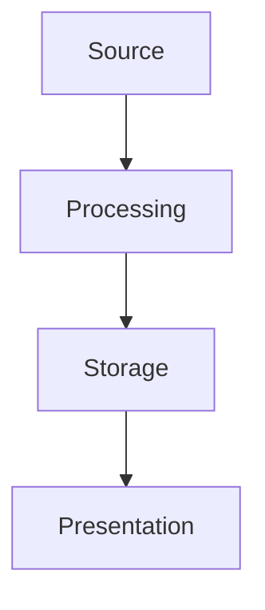

# PRD Template

> This template is used by the Strategist Agent in STATE 2. Every section is MANDATORY. No section may contain "TBD", "To be defined", or be left empty.

---

| Field | Details |
| :--- | :--- |
| **Project** | [Project Name] |
| **Project Code** | [Code] |
| **Status** | Draft |
| **Owner** | [Names] |
| **Date** | [Date] |
| **Priority** | P0 / P1 / P2 |
| **Dependencies** | [List all external teams/systems] |

---

## 1. Executive Summary

### The "Why"
[2-3 paragraphs. What is the business problem? Why does it matter NOW? Include quantified pain — cost, time, headcount, SLA breaches. Cite sources from the harvested context.]

### The "What"
[1-2 paragraphs. What are we building? High-level scope. What is explicitly OUT of scope?]

### Expected Impact
[Bullet list of measurable outcomes. Every bullet must have a number.]

---

## 2. Success Metrics & KPIs

| Metric | Baseline | Target | How Measured |
| :--- | :--- | :--- | :--- |
| [Metric 1] | [Current value] | [Target value] | [Instrumentation method] |

> Every metric must have a defined instrumentation method. If we can't measure it, we can't ship it.

---

## 3. Users, Roles & Permissions (RBAC)

| Role | Capabilities | View Scope | Authentication |
| :--- | :--- | :--- | :--- |
| [Role 1] | [What they can do] | [What they can see] | [SSO/2FA/Token] |

> Include the "System" role for automated actions (cron jobs, webhooks, background workers).

---

## 4. System Architecture

### 4.1 Architecture Diagram

> Replace with actual architecture. Show data flows, queues, databases, external APIs.

### 4.2 Integration Contracts
| Integration | Direction | Protocol | Payload | Error Handling |
| :--- | :--- | :--- | :--- | :--- |
| [System A] | Inbound/Outbound | REST/Webhook/gRPC | [Link to schema] | [Retry/DLQ/Circuit breaker] |

### 4.3 Data Model (Key Entities)
| Entity | Key Fields | Relationships |
| :--- | :--- | :--- |
| [Entity 1] | [field1, field2, ...] | [FK to Entity2] |

---

## 5. Detailed Feature Specifications

### Phase 1: [Phase Name] (P0 — Must Have)

#### 5.1 [Feature Group Name]
| Req ID | Feature | Description | Validation Rules |
| :--- | :--- | :--- | :--- |
| **XX-01** | [Feature] | [Detailed description] | [Field constraints, limits] |

### Phase 2: [Phase Name] (P1 — Should Have)
[Same table format]

### Phase 3+: [Phase Name] (P2 — Nice to Have)
[Same table format]

---

## 6. User Flows

### Flow 1: [Happy Path Name]
1. [Step-by-step numbered flow]
2. [Include decision points]

### Flow 2: [Unhappy Path / Edge Case Name]
1. [Step-by-step describing failure scenario]
2. [How the system recovers]

> Minimum 2 happy paths and 3 unhappy paths required.

---

## 7. User Stories (Gherkin)

> Minimum 8 stories required. Must cover: Happy paths, Unhappy paths, Edge cases, Admin/Supervisor perspectives.

**US.X.X ([Story Title])**
- **Given** [precondition with specific values]
- **And** [additional precondition if needed]
- **When** [user action — specific and concrete]
- **Then** [observable, measurable outcome]
- **And** [additional outcome if needed]

> Every `Then` must be testable by QA without interpretation. Bad: "system works correctly." Good: "response status is 200 AND payload contains `ticket_id` field."

---

## 8. Non-Functional Requirements

| Category | Requirement | Target | Measurement |
| :--- | :--- | :--- | :--- |
| **Performance** | [e.g., API latency] | [e.g., < 200ms p95] | [APM tool] |
| **Security** | [e.g., PII handling] | [e.g., encrypted at rest] | [Audit] |
| **Availability** | [e.g., uptime] | [e.g., 99.9%] | [Monitoring] |
| **Scalability** | [e.g., concurrent users] | [e.g., 10x current] | [Load test] |

---

## 9. Rollout & Migration Plan

| Phase | Scope | Traffic % | Duration | Rollback Trigger | Monitoring |
| :--- | :--- | :--- | :--- | :--- | :--- |
| Canary | [Subset] | 5% | [Time] | [Condition] | [Dashboard/Alert] |

---

## 10. Open Questions & Risks

| # | Question / Risk | Owner | Due Date | Status |
| :--- | :--- | :--- | :--- | :--- |
| 1 | [Specific question] | [Person] | [Date] | Open / Resolved |
