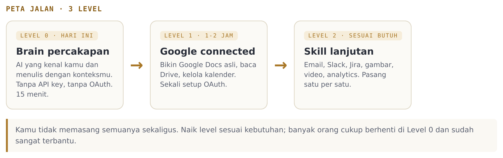
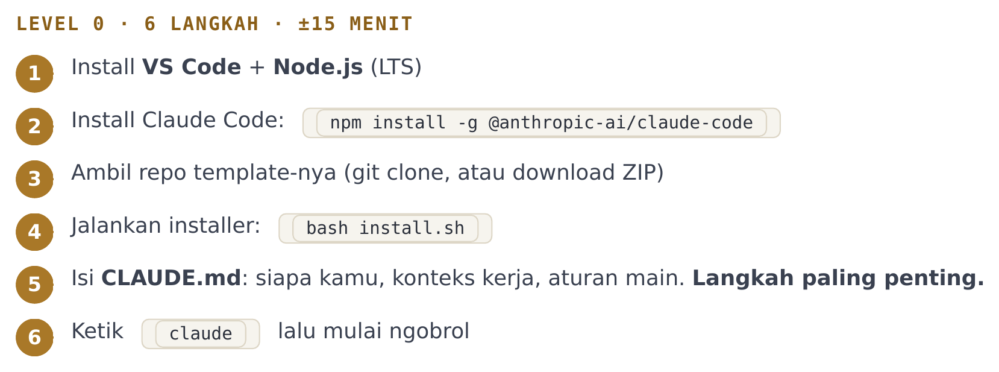
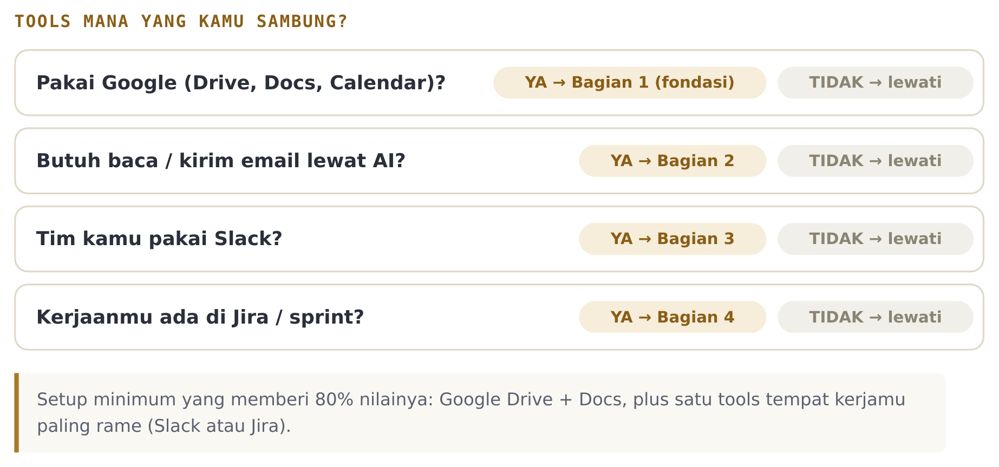

### Apa yang kamu butuhkan, dan urutan memulainya

Dokumen ini adalah titik awalmu. Baca ini **sebelum** workshop (atau sebelum kamu mulai setup sendiri). Isinya tiga hal: apa yang perlu kamu siapkan, peta jalan dari nol sampai second brain yang bisa bertindak, dan langkah pertama yang bisa kamu kerjakan hari ini juga.

Kabar baiknya: kamu **tidak perlu bisa coding.** Kalau kamu bisa copy-paste dan mengikuti langkah, kamu bisa memasang ini.

---

## Yang Perlu Kamu Siapkan

Sebelum mulai, pastikan lima hal ini ada. Empat pertama gratis.

| Kebutuhan | Keterangan | Biaya |
| :--- | :--- | :--- |
| **Laptop** | Windows 10/11, macOS, atau Linux | Sudah punya |
| **VS Code** | Editor tempat semuanya berjalan. Gratis. [code.visualstudio.com](https://code.visualstudio.com) | Gratis |
| **Akun Claude** | Otak dari sistemnya. Langganan Claude Pro (atau Claude API key). [claude.ai](https://claude.ai) | ~$20/bln |
| **Koneksi internet** | Untuk instalasi dan login | Sudah punya |
| **Akun tools yang kamu pakai** | Google, Slack, Jira: hanya yang benar-benar kamu pakai | Sudah punya |

> **Catat.** Yang berbayar cuma satu: langganan Claude. Satu langganan itu memberimu chat, agent, dan semua skill di repo (notulen, laporan, otomasi, dokumen, gambar, video, data). Kamu tidak beli banyak tools; kamu merakit tools sendiri dari satu langganan.

---

## Peta Jalan: 3 Level

Kamu tidak memasang semuanya sekaligus. Kamu naik level sesuai kebutuhan. Banyak orang cukup berhenti di Level 0 dan sudah sangat terbantu.



**Level 0: Brain Percakapan (15 menit, hari ini).**
AI yang kenal kamu, gaya kerjamu, dan aturanmu, langsung di dalam editor. Tanpa API key, tanpa OAuth. Ini sudah menghasilkan second brain yang bisa dipakai kerja hari ini. Panduannya: `docs/INSTALL_ID.md` di dalam repo.

**Level 1: Google Connected (1-2 jam, di rumah).**
Second brain bisa membuat Google Docs asli, membaca Drive, dan mengelola kalendermu. Ini setup OAuth sekali seumur pemakaian. Panduannya: **Panduan Koneksi**, Bagian 1.

**Level 2: Skill Lanjutan (sesuai kebutuhan).**
Sambungkan Email, Slack, Jira, dan lainnya, satu per satu, hanya yang kamu pakai. Panduannya: **Panduan Koneksi**, Bagian 2 sampai 4.

> **Prinsipnya.** Kamu tidak lagi menunggu ada tools jadi. Kamu merakit tools-mu sendiri, satu skill kecil setiap kali butuh.

---

## Langkah Pertama Hari Ini (Level 0)

Ini enam langkah menuju second brain pertamamu. Detail tiap langkah ada di `docs/INSTALL_ID.md`; ini gambaran besarnya:



Ambil repo template-nya di sini:

```bash
git clone https://github.com/BrianArfi/ai-second-brain.git
cd ai-second-brain
bash install.sh
```

Belum punya `git` atau `npm`? Tidak apa-apa. Buka `docs/INSTALL_ID.md`, di sana ada cara memasangnya untuk Windows dan macOS, plus cara download repo tanpa git (via ZIP).

> **Langkah terpenting dari semuanya.** Setelah `install.sh`, buka file `CLAUDE.md` dan isi tiga hal: siapa kamu (nama, peran, perusahaan), konteks kerjamu (proyek yang jalan, siapa stakeholder-nya), dan aturan mainmu (format dokumen favorit, bahasa, hal yang tidak boleh). Makin jujur dan spesifik, makin berguna second brain-mu. Ini bagian yang membedakan AI generik dengan partner yang benar-benar kenal kamu.

---

## Tools Mana yang Perlu Kamu Sambung?

Kamu tidak perlu menyambung semuanya. Pakai peta keputusan ini untuk memilih apa yang dipasang di Level 1 dan 2:



**Setup minimum yang memberi 80% nilainya:** Google Drive + Docs, plus satu tools tempat kerjamu paling sering (Slack atau Jira). Sisanya tambahkan belakangan saat butuh.

---

## Prinsip yang Bikin Ini Gampang

Satu hal yang mengubah seluruh pengalaman setup: **kalau macet, tanya Claude.**

Setiap kali ada error, jangan langsung menyerah atau meng-Google. Copy pesan errornya, tempel ke terminal `claude`, minta dia perbaiki. Dia yang membereskan. Ini lebih dari jalan pintas: inilah cara kerja AI-Native, di mana AI ikut menyiapkan dirinya sendiri sebagai partnermu.

Kamu tidak perlu paham setiap baris kode. Kamu cukup tahu tujuanmu, dan biarkan partner AI-mu yang mengurus detail teknisnya.

---

## Ringkasan Dokumen

| Dokumen | Isinya | Kapan dibaca |
| :--- | :--- | :--- |
| **Mulai Dari Sini** (ini) | Apa yang dibutuhkan + peta jalan | Sekarang, sebelum mulai |
| `docs/INSTALL_ID.md` (di repo) | Level 0 langkah demi langkah | Saat memasang second brain pertama |
| **Panduan Koneksi** | Menyambung Google, Email, Slack, Jira secara visual | Saat naik ke Level 1 dan 2 |

Selamat memulai. Setelah Level 0, kamu sudah punya partner yang menulis dengan konteksmu. Setelah Panduan Koneksi, dia bisa bertindak untukmu.

---

_Mulai Dari Sini: AI Second Brain · dibagikan untuk peserta workshop AI Circle · repo template: github.com/BrianArfi/ai-second-brain_
