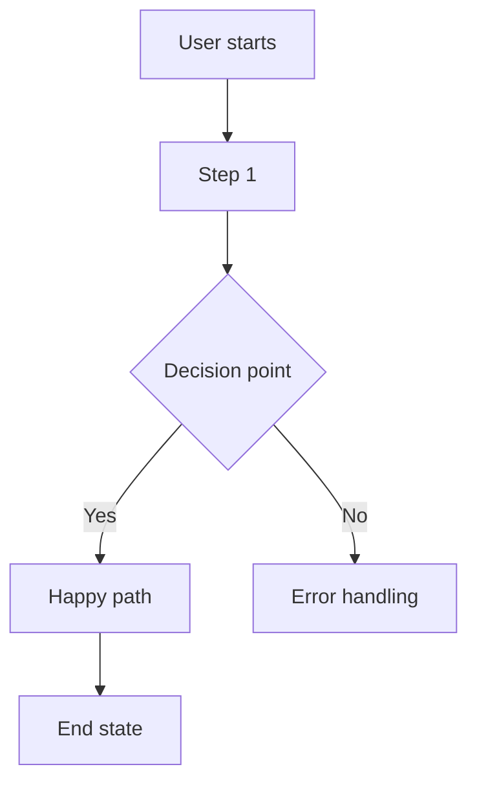

# PRD: [Feature Name]

| Field | Value |
|:---|:---|
| Project | [Project Name — e.g. Seller Portal, B2C SuperApp] |
| Feature | [Feature Name] |
| Status | Draft |
| Owner | Your Name |
| Version | v0.1 |
| Date | [YYYY-MM-DD] |

---

## Executive Summary

### The Why
[Problem statement — what user/business pain does this solve?]

### The What
[High-level description of the solution in 2–3 sentences]

---

## Success Metrics

| Metric | Baseline | Target | How Measured |
|:---|:---|:---|:---|
| [e.g. Conversion Rate] | [Current %] | [Goal %] | [Analytics tool / method] |
| [e.g. Task Completion Time] | [Current] | [Goal] | [How] |

---

## User Stories

| # | As a... | I want to... | So that... | Priority |
|:---|:---|:---|:---|:---|
| 1 | [User type] | [Action] | [Benefit] | P0 |
| 2 | [User type] | [Action] | [Benefit] | P1 |

---

## Feature Requirements

### Phase 1 — P0 (Must Have)

| # | Requirement | Notes |
|:---|:---|:---|
| 1 | [Requirement description] | |
| 2 | [Requirement description] | |

### Phase 2 — P1 (Should Have)

| # | Requirement | Notes |
|:---|:---|:---|
| 1 | [Requirement description] | |

### Out of Scope
- [Item explicitly excluded]
- [Item explicitly excluded]

---

## Flow Diagram

---

## Open Questions

| # | Question | Owner | Due |
|:---|:---|:---|:---|
| 1 | [Question to resolve] | [Name] | [Date] |

---

## Dependencies & Risks

| Type | Description | Mitigation |
|:---|:---|:---|
| Dependency | [e.g. Requires OMS API v2] | [Plan B] |
| Risk | [e.g. Third-party integration delay] | [Mitigation] |

---

## Revision History

| Revision | Date | Summary |
|:---|:---|:---|
| v0.1 | [YYYY-MM-DD] | Initial draft |
